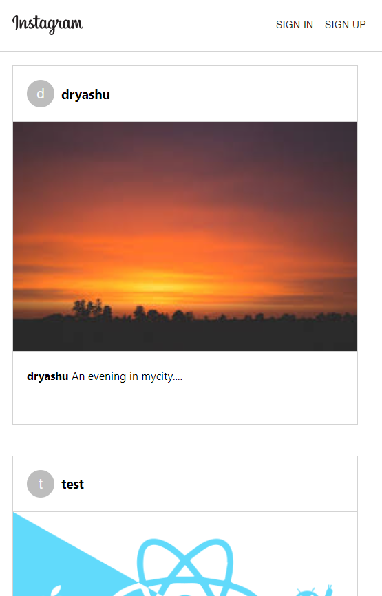
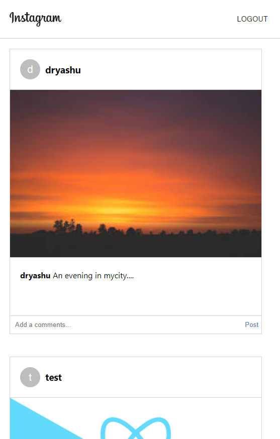
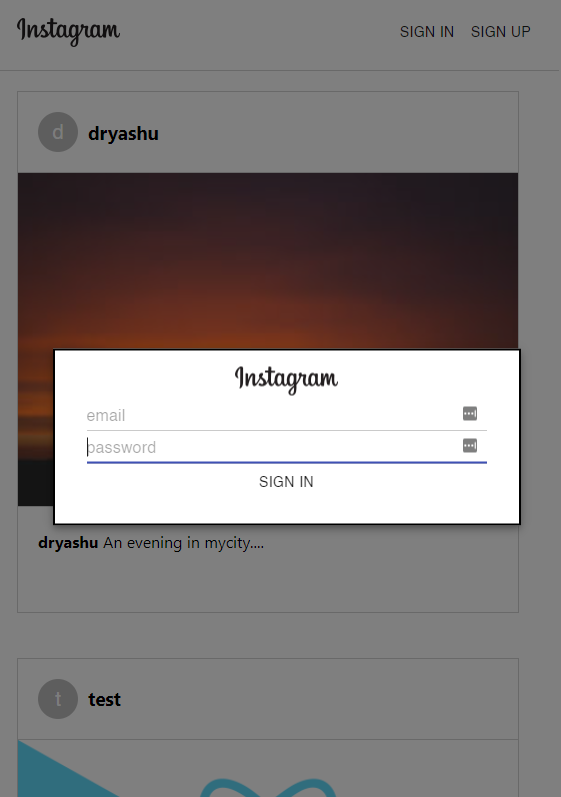
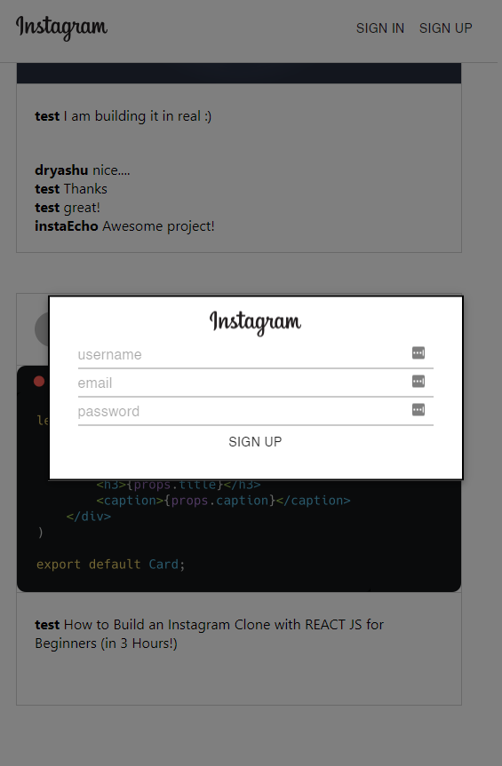

# Instagram Clone

## react.js and firebase

## Table of Contents

---

1. [General Info](#general-info)
2. [Technologies](#technologies)
3. [Screenshots](#screenshot)
4. [Installation](#installation)

### General Info

---

This project aims at creating a clone of instagram App for practice purpose to understand the react, material-ui with firebase functionality and the functionality of Instagram App.

### Screenshot

---

#### Home Page



#### User's Page



#### Edit Student Page



#### Add Student Page



## Technologies

---

A list of technologies used within the project:

- [React.js](https://reactjs.org/): Version 17.0.2
- [Material-UI](https://material-ui.com/): Version 4.11
- [firebase](https://firebase.google.com/): Version 7.17.1
- [React Instagram Embed](https://www.npmjs.com/package/react-instagram-embed): Version 1.5.0

## Installation

---

A little intro about the installation.

```
$ git clone https://github.com/gopeshwark/react-instagram-clone.git
$ cd ./react-instagram-clone/
$ npm install
$ npm start
```
